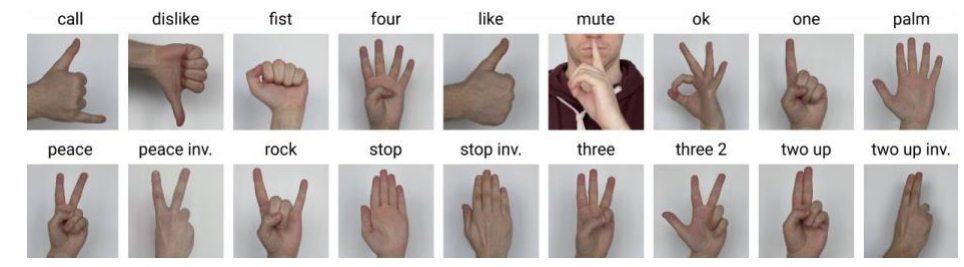

# Hand Gesture Control with Arduino and YOLO

This project allows you to control an Arduino robotic arm using hand gestures detected by a YOLO (You Only Look Once) object detection model. The system captures real-time video from a webcam, processes it using YOLO to identify hand gestures, and sends corresponding commands to the Arduino to perform actions with the robotic arm.




## Prerequisites

- Python 3.x
- OpenCV
- Ultralytics YOLO `pip install ultralytics`
- Other imported Libraries
- Arduino board
- Braccio robotic arm
- Webcam

## Setup Instructions


1. Connect the Braccio robotic arm to the Arduino board and make sure the servo motors are properly connected. ( Use the Braccio shield)
2. Install the required Python libraries `opencv-python` and `ultralytics` using pip.
3. Upload the Arduino code to the Arduino board using the Arduino IDE.
4. Download the trained model
5. Update the Python code with the correct COM port for the Arduino serial connection and make sure to change the model path.
6. Run the Python script to start the hand gesture control system.

## Code Explanation

### Python Code
```
from ultralytics import YOLO
import cv2
import math
import serial
import time
import threading
```
- The code imports necessary libraries/modules: `ultralytics.YOLO` for object detection using YOLO, `cv2` for accessing webcam and image processing, `math` for mathematical operations, `serial` for serial communication with the Arduino, `time` for delays, and `threading` for multi-threading.
```
def send_command(gesture):
    ser.write((gesture + ';').encode())
    time.sleep(0.1)  # Delay to prevent overwhelming the serial port
```
- This defines a function `send_command` that takes a gesture parameter. Inside the function, it sends the gesture command to the Arduino by writing it to the serial connection `ser.write()`, and adds a semicolon (;) as a delimiter. It also includes a delay of 0.1 seconds using `time.sleep()` to prevent overwhelming the serial port.
```
cap = cv2.VideoCapture(0)
cap.set(3, 640)
cap.set(4, 480)
```
- This initializes the webcam capture by creating a VideoCapture object `cap`. It sets the width and height of the captured frames to 640x480 pixels using the `set()` method.
```
model = YOLO(r"C:\Users\engma\Desktop\data\yolo\best.pt")
```
- This creates an instance of the YOLO object detection model from Ultralytics. It loads the model weights from the file path specified `"C:\Users\engma\Desktop\data\yolo\best.pt"`.

```
classNames = ['call', 'dislike', 'fist', 'four', 'like', 'mute', 'ok', 'one', 'palm', 'peace', 'peace_inverted', 'rock', 'stop', 'stop_inverted', 'three', 'three2', 'two_up', 'two_up_inverted']
```
- This defines a list `classNames` that contains the names of different hand gesture classes that the YOLO model can detect.

```
ser = serial.Serial('COM5', 9600)
if not ser.isOpen():
    ser.open()  # Open the serial connection if it's not already open
```
- This creates a serial connection `ser` to the Arduino using the specified port (COM5) and baud rate (9600). If the connection is not open, it opens the serial connection.

```
while True:
    success, img = cap.read()
    results = model(img, stream=True)
```
- This starts an infinite loop that continuously captures frames from the webcam using `cap.read()`. The captured frame is stored in `img`. The model performs object detection on the `img` and returns the detection results, which are stored in `results`.

```
for r in results:
    boxes = r.boxes

    for box in boxes:
        # Bounding box
        x1, y1, x2, y2 = box.xyxy[0]
        x1, y1, x2, y2 = int(x1), int(y1), int(x2), int(y2)  # Convert to int values

        # Confidence
        confidence = math.ceil((box.conf[0] * 100)) / 100
        print("Confidence --->", confidence)

        # Class name
        cls = int(box.cls[0])
        gesture = classNames[cls]
        print("Class name -->", gesture)

        # Send gesture command to Arduino using a separate thread
        threading.Thread(target=send_command, args=(gesture,)).start()
```
- This loop iterates over the results of the object detection. For each detected hand gesture, it extracts the coordinates of the bounding box `x1, y1, x2, y2`. It also calculates the confidence score of the detection `confidence`. It determines the class index `cls` and maps it to the corresponding gesture class name from `classNames`. It then prints the confidence and gesture name. Finally, it starts a new thread to send the gesture command to the Arduino using the `send_command` function.

```
ser.close()
```
- This line closes the serial connection with the Arduino when the loop is terminated or interrupted.


The Python code uses the Ultralytics YOLO library to perform object detection on the video frames captured from the webcam. Here's a brief explanation of the key parts of the code:

- The `send_command()` function sends gesture commands to the Arduino using serial communication.
- The webcam is initialized using OpenCV, and the video frames are resized to a resolution of 640x480.
- The YOLO model is loaded using the `YOLO()` constructor from the Ultralytics library.
- The `classNames` list contains the names of the hand gesture classes recognized by the YOLO model.
- The serial connection is established with the Arduino board using the specified COM port.
- The main loop captures video frames from the webcam, processes them using YOLO, and extracts the detected hand gestures.
- The detected hand gestures are sent as commands to the Arduino to control the robotic arm.
- The code also includes additional functionality for displaying the webcam feed and handling key events.

### Arduino Code
```
#include <Wire.h>
#include <Braccio.h>
#include <Servo.h>
```
- These lines include the necessary libraries: `Wire.h` for I2C communication, `Braccio.h` for controlling the Braccio robotic arm, and `Servo.h` for controlling the servos.

```
Servo base;
Servo shoulder;
Servo elbow;
Servo wrist_ver;
Servo wrist_rot;
Servo gripper;
```
- These lines declare Servo objects for each joint of the Braccio robotic arm: base, shoulder, elbow, wrist_ver, wrist_rot, and gripper.

```
const char DELIMITER = ';';
```

- This line defines a constant variable DELIMITER with the value ';'. It will be used as a delimiter to separate commands received over the serial communication.

```
int M1;
int M2;
int M3;
int M4;
int M5;
int M6;
int M1_max = 180;
int M2_max = 165;
int M3_max = 180;
int M4_max = 180;
int M5_max = 180;
int M6_max = 73;
int M2_min = 15;
int M6_min = 10;
```

- These lines declare variables to store the current positions (M1, M2, M3, M4, M5, M6) and the maximum positions (M1_max, M2_max, M3_max, M4_max, M5_max, M6_max) for the servos. They also define the minimum positions for M2 and M6 servos (M2_min, M6_min).

```
int prev_M1;
int prev_M2;
int prev_M3;
int prev_M4;
int prev_M5;
int prev_M6;
```

- These lines declare variables to store the previous positions of the servos (prev_M1, prev_M2, prev_M3, prev_M4, prev_M5, prev_M6). They will be used when releasing or gripping the gripper (Motor 6).

```
void setup() {
  Serial.begin(9600);
  Braccio.begin();
}
```

- This is the `setup()` function that runs once when the Arduino starts. It initializes the serial communication with a baud rate of 9600 using `Serial.begin()`. It also initializes the Braccio robotic arm using `Braccio.begin()`.

```
void loop() {
  while (Serial.available() > 0) {
    String command = Serial.readStringUntil(DELIMITER);
    processCommand(command);
    delay(100); // Reduced delay between commands
  }
}
```

- This is the `loop()` function that runs repeatedly. It continuously checks if there is any data available from the serial communication using `Serial.available()`. If data is available, it reads the received command until the `DELIMITER` character (';') using `Serial.readStringUntil()`, and stores it in the command variable. Then, it calls the `processCommand()` function to perform actions based on the received command. It adds a delay of 100 milliseconds between commands.

```
void processCommand(String command) {
  // Store previous values
  prev_M1 = M1;
  prev_M2 = M2;
  prev_M3 = M3;
  prev_M4 = M4;
  prev_M5 = M5;
  prev_M6 = M6;

  // Perform actions based on received commands
  if (command == "like") {
    Braccio.ServoMovement(20, 20, 20, 20, 20, 20, 50);
  } else if (command == "dislike") {
    Braccio.ServoMovement(20, 20, 50, 25, 50, 25, 50);
  } else if (command == "call") {
    Braccio.ServoMovement(20, 50, 20, 50, 20, 50, 35);
  } else if (command == "mute") {
    Braccio.ServoMovement(20, 50, 50, 50, 50, 50, M6_max);
  } else if (command == "ok") {
    Braccio.ServoMovement(20, 70, 70, 70, 70, 70, M6_max);
  } else if (command == "peace") {
    Braccio.ServoMovement(20, 50, 70, 50, 70, 50, M6_max);
  } else if (command == "stop") {
    // Release the gripper (Motor 6)
    Braccio.ServoMovement(20, prev_M1, prev_M2, prev_M3, prev_M4, prev_M5, M6_min);
    M6 = M6_min; // Update the current value of M6 to M6_min
  } else if (command == "fist") {
    // Grip with the gripper (Motor 6)
    Braccio.ServoMovement(20, prev_M1, prev_M2, prev_M3, prev_M4, prev_M5, M6_max);
    M6 = M6_max; // Update the current value of M6 to M6_max
  } else if (command == "peace_inverted") {
    Braccio.ServoMovement(20, 100, 50, 100, 50, 100, M6_max);
  } else if (command == "stop_inverted") {
    Braccio.ServoMovement(20, 50, 140, 50, 140, 50, M6_max);
  }
  // Add more conditions for other gestures and their corresponding actions
}
```
- This is the `processCommand()` function that takes a String parameter command representing the received command. It first stores the previous positions of the servos. Then, based on the received command, it performs corresponding actions using the `Braccio.ServoMovement()` function to control the servos accordingly. The actions include predefined movements for gestures like "like," "dislike," "call," "mute," "ok," "peace," "stop," "fist," "peace_inverted," and "stop_inverted." You can add more conditions and corresponding actions for other gestures as needed.


The Arduino code receives gesture commands from the Python script and controls the servo motors of the Braccio robotic arm accordingly. Here's a brief explanation of the key parts of the code:

- The `processCommand()` function parses the received command and updates the corresponding motor value.
- The `getMotorValue()` function extracts the motor value from the command and limits it within the allowed range.
- The `loop()` function continuously checks for available serial data and processes the received commands.
- The motor values are compared with the previous values, and if there's a change, the corresponding servo motor is moved using the `Braccio.ServoMovement()` function.

## License

This project is licensed under the [MIT License](LICENSE).

## Acknowledgments

- The YOLO object detection model used in this project is developed and maintained by the Ultralytics team. You can find their GitHub repository at [https://github.com/ultralytics/yolov5](https://github.com/ultralytics/yolov5).
- The Braccio robotic arm is a product of [Arduino](https://www.arduino.cc/).
- The dataset used to train the model and used for the control is [HAgrid](https://github.com/hukenovs/hagrid)
